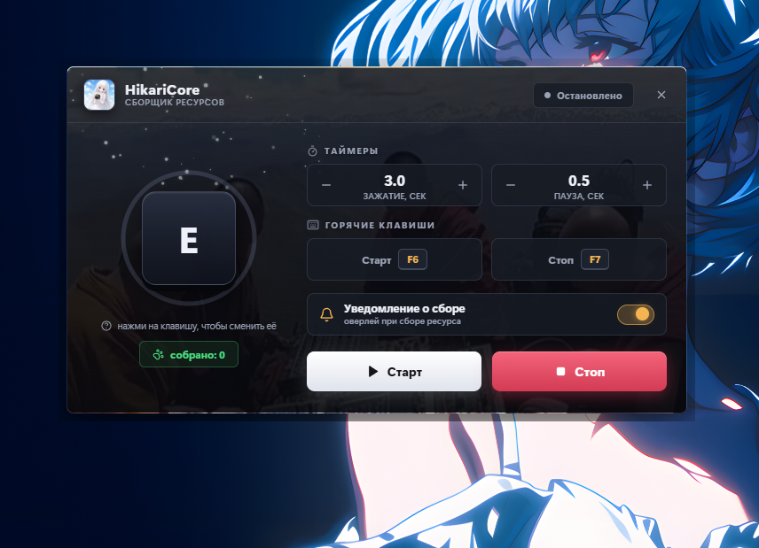

<div align="center">


# ✨ HikariCore

**Умный авто-зажиматель клавиш для фарма ресурсов в играх**
Зажимает нужную клавишу на заданное время, делает паузу и повторяет — а ты занимаешься своими делами.

<br>

[](https://alalal68-wq.github.io/)
[](https://www.youtube.com/@python-v7)
[](https://www.donationalerts.com/r/bugcrack1)

<br>

### [](https://github.com/alalal68-wq/HikariCore/releases/latest)

<sub>Скачивает последнюю версию из <a href="https://github.com/alalal68-wq/HikariCore/releases/latest">релизов</a></sub>

<br>


</div>

---

## 🎬 Демонстрация

<div align="center">


<sub>HikariCore в деле — настройка, запуск и авто-сбор ресурсов. Полную версию смотри на <a href="https://www.youtube.com/@python-v7">YouTube</a>.</sub>

</div>

<br>

<div align="center">
  
  <br>
  <sub>Главное окно HikariCore — широкий тёмный интерфейс с живым фоном</sub>
</div>

---

## 🌸 Что это такое

**HikariCore** (от яп. *光* — «свет») — лёгкая утилита для геймеров, которая автоматизирует рутину фарма. Во многих играх сбор ресурсов требует **удерживать** клавишу (например, `E`) несколько секунд возле каждого объекта. Делать это руками сотни раз — утомительно. HikariCore берёт это на себя:

1. Нажимает и **держит** заданную клавишу выбранное число секунд.
2. Отпускает, делает **паузу** нужной длины.
3. Повторяет цикл — пока ты не остановишь.
4. После каждого сбора показывает **уведомление поверх игры** «Ресурсы собраны!».

Всё это — в стильном тёмном окне с анимированным фоном и плавными частицами.

---

## 🚀 Возможности

| Функция | Описание |
|---|---|
| ⌨️ **Авто-зажатие** | Удерживает любую клавишу заданное время и повторяет циклами |
| 🎯 **Любая клавиша** | Клавишу для зажатия можно сменить одним кликом по большому кейкапу |
| ⏱️ **Гибкие таймеры** | Раздельная настройка времени **зажатия** и **паузы** (от 0.5 до 600 сек) |
| 🔥 **Горячие клавиши** | Бинды Старт/Стоп вешаются на любую кнопку клавиатуры, работают даже когда игра в фокусе |
| 🔔 **Оверлей в игре** | Уведомление о сборе всплывает поверх игры (режим «Оконный без рамок») |
| 📊 **Счётчик сбора** | Показывает, сколько циклов уже выполнено |
| 🌀 **Кольцо прогресса** | Вокруг кейкапа крутится индикатор, синхронный с таймером зажатия |
| 🎨 **Живой UI** | Тёмный интерфейс на HTML/CSS с фоновой картинкой и плавающими белыми частицами |

---

## 🖼️ Об обоях (`bg.png`)

Файл **`bg.png`** — это фоновое изображение интерфейса. Оно лежит под полупрозрачным тёмным слоем, поэтому картинка видна как лёгкая атмосферная подложка, но не мешает читать текст и элементы управления.

- Хочешь свой фон — просто **замени `bg.png`** на любую свою картинку (желательно широкую, под формат окна 700×392).
- Тёмный слой и частицы подстроятся автоматически — менять код не нужно.
- Чем темнее и спокойнее исходник, тем читабельнее интерфейс.

---

## 🛠️ Технологии

- **Python 3.10+** — ядро и логика
- **PyQt6 + PyQt6-WebEngine** — окно и встроенный браузерный движок для UI
- **QWebChannel** — мост между Python (логика) и JavaScript (интерфейс)
- **keyboard** — глобальные хуки и эмуляция нажатий
- **HTML / CSS / JS** — весь дизайн вынесен в отдельный `ui.html`
- **PyInstaller** — сборка в один `.exe`

Архитектура простая: `auto_hold.py` держит всю логику, `ui.html` — весь внешний вид. Они общаются через `bridge` — JS вызывает методы Python (`start`, `stop`, `setHold`…), а Python шлёт сигналы обратно (`stateChanged`, `cycleDone`, `bindCaptured`).

---

## 📦 Установка и запуск

### Вариант 1 — готовый exe (проще всего)

1. **[⬇️ Скачай последнюю версию HikariCore](https://github.com/alalal68-wq/HikariCore/releases/latest)** из раздела Releases.
2. Распакуй архив `HikariCore.zip`.
3. Запусти **`HikariCore.exe`** от имени администратора (правый клик → «Запуск от имени администратора»).
4. Готово.

### Вариант 2 — из исходников

```bash
# 1. Установи зависимости
pip install PyQt6 PyQt6-WebEngine keyboard

# 2. Положи рядом файлы: auto_hold.py, ui.html, bg.png, logo.png, icon.ico

# 3. Запусти (Windows — желательно от администратора)
python auto_hold.py
```

### Вариант 3 — собрать свой exe

Просто запусти **`build_HikariCore.bat`** — он сам поставит зависимости, очистит старую сборку и соберёт один файл. Под капотом:

```bash
pyinstaller --noconfirm --clean --onefile --windowed --uac-admin ^
  --name "HikariCore" --icon "icon.ico" ^
  --add-data "ui.html;." --add-data "bg.png;." ^
  --add-data "logo.png;." --add-data "icon.ico;." ^
  auto_hold.py
```

Готовый `HikariCore.exe` появится в папке `dist/`.

---

## 🎮 Как пользоваться

1. Запусти HikariCore — появится тёмное окно поверх остальных.
2. Кликни по большому **кейкапу** в центре и нажми клавишу, которую нужно зажимать в игре (по умолчанию `E`).
3. Выстави **время зажатия** и **паузу** кнопками `−` / `+`.
4. При желании переназначь бинды **Старт** (`F6`) и **Стоп** (`F7`) на удобные клавиши.
5. Переключи игру в режим **«Оконный без рамок»**, чтобы видеть уведомления о сборе.
6. Нажми **Старт** (или бинд) — и фарм пошёл. **Стоп** останавливает в любой момент.

---

## 🐛 Известные баги и их решения

За время разработки наступили на несколько граблей — вот они и как решены:

| Проблема | Причина | Решение |
|---|---|---|
| Игра игнорировала нажатия | Приложение запущено без прав администратора, а игра — с ними | Запускать HikariCore **от имени администратора** (в exe это зашито через `--uac-admin`) |
| Оверлей «Ресурсы собраны» не виден в игре | Игра в **эксклюзивном полноэкранном** режиме — Windows не рисует поверх него чужие окна | Переключить игру в **«Оконный без рамок»** (Borderless Windowed) |
| Белый/чёрный квадрат вместо прозрачного окна | WebEngine по умолчанию рисует непрозрачный фон | Выставлен прозрачный фон страницы: `setBackgroundColor(QColor(0,0,0,0))` + `WA_TranslucentBackground` |
| `ui.html` / `bg.png` не находились в собранном exe | PyInstaller распаковывает ресурсы во временную папку `_MEIPASS` | Добавлена функция `resource_path()`, которая корректно ищет файлы и в исходниках, и внутри exe |
| `qwebchannel.js` не загружался | Локальной странице по умолчанию запрещён доступ к ресурсам Qt | Включены `LocalContentCanAccessRemoteUrls` и `LocalContentCanAccessFileUrls` |
| Частицы «улетали» по прямой и копились в углу | У частиц был фиксированный вектор движения | Добавлено случайное блуждание — направление слегка меняется каждый кадр |
| Уведомление всплывало, даже когда выключено | Сигнал `cycleDone` всегда дёргал оверлей | Добавлен флаг `notify_enabled` и проверка перед показом |

---

## ⚠️ Важно знать

- **Windows only** — `keyboard` и оверлей заточены под Windows.
- **Права администратора** обязательны, иначе многие игры не примут нажатия.
- **Режим игры** — только «Оконный без рамок» для видимости уведомлений (визуально не отличается от фуллскрина).
- ⚖️ **Используй с умом.** В некоторых онлайн-играх автоматизация и макросы **запрещены правилами** и могут привести к бану. Проверяй правила своей игры — ответственность за использование на тебе.

---

## 📁 Структура проекта

```
HikariCore/
├── auto_hold.py          # логика: зажатие, бинды, оверлей, мост с UI
├── ui.html               # весь интерфейс (HTML/CSS/JS)
├── bg.png                # фоновое изображение окна
├── logo.png              # логотип приложения
├── icon.ico              # иконка для exe и окна
├── build_HikariCore.bat  # авто-сборка в один exe
└── assets/               # медиа для README (логотип, demo.gif, скриншот)
```

---

## 🔗 Ссылки

<div align="center">

| | |
|---|---|
| 🌐 **Сайт** | [alalal68-wq.github.io](https://alalal68-wq.github.io/) |
| 📺 **YouTube** | [@python-v7](https://www.youtube.com/@python-v7) |
| 💛 **Донат** | [donationalerts.com/r/bugcrack1](https://www.donationalerts.com/r/bugcrack1) |

</div>

---

<div align="center">

### [](https://github.com/alalal68-wq/HikariCore/releases/latest)

<br>

**Сделано с ✨ для геймеров, которым лень фармить вручную**

Если HikariCore сэкономил тебе время — поставь ⭐ репозиторию и поддержи разработку донатом 💛

</div>
